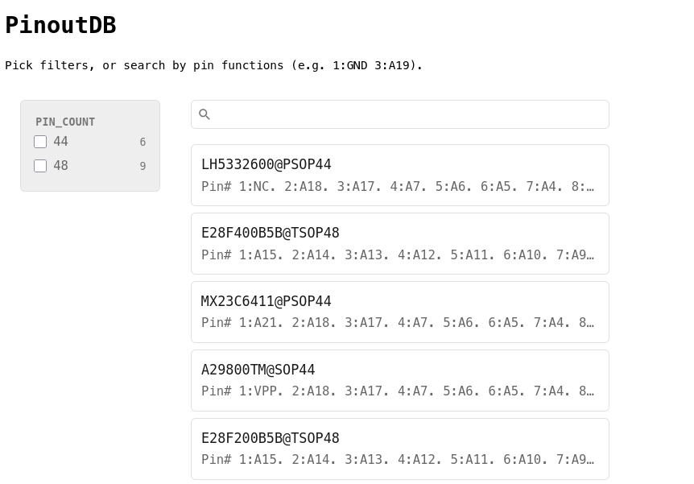

Find IC pinouts matching specific pin number:function pairs.

Despite several datasheets being available online, sometimes we don't find one for our IC. Or maybe we are dealing with an epoxy blob. Still, we might be able to identify ground, power, and some other pins. This tool helps finding ICs that match those guesses. However, it's still very incomplete, as each known pinout was manually put together from datasheets...

```sh
# Download and parse minipro's ICs database
./build.sh

# Generate pages for each IC mapped to known pinouts
./gen.py

# Serve pages
python3 -m pagefind --site docs --include-characters=: --serve
```
